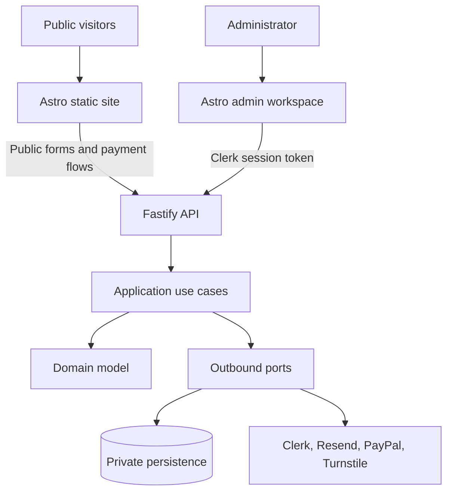

# Carlos Pinto Digital Consulting Platform

A premium bilingual consulting portfolio, lead intake platform, private operations dashboard and payment-request experience for Carlos Pinto.

## Status

The repository is delivered issue by issue. The current foundation establishes a strict TypeScript monorepo, an Astro public application shell, an API application shell, shared package boundaries, automated validation and phone-friendly operating documentation.

## Workspace

```text
apps/
  api/       API and business capabilities
  web/       Static public experience and focused interactive islands
packages/
  config/    Provider-neutral configuration contracts
  contracts/ Shared API and form contracts
  testing/   Reusable deterministic test helpers
database/    Versioned SQL migrations and database operating notes
docs/        Architecture, deployment, operations and ADRs
tests/       Cross-application acceptance and architecture tests
```

## Local commands

```bash
corepack enable
pnpm install --no-frozen-lockfile
pnpm run ci
pnpm build
```

Run the API and web frontend from two terminals:

```bash
pnpm --filter @carlos-pinto/api start
pnpm --filter @carlos-pinto/web dev -- --host 127.0.0.1 --port 4321
```

Run the API and web frontend from two terminals:

```bash
cp .env.example .env
pnpm dev:api
pnpm dev:web
```

The local start scripts load the workspace-root `.env` file. Public pages and forms work with the
example defaults; the private administrator dashboard requires real Clerk development credentials
and an administrator allowlist. See
[docs/development/local-admin-clerk.md](docs/development/local-admin-clerk.md).

Node.js 24 LTS and pnpm 11.5.2 are pinned. CI is the source of truth when operating only from a phone.

## Enterprise Architecture

The platform separates static public delivery, private administrator operations and provider
integration behind explicit trust boundaries. Public visitors never need identity, while
administrator actions require a real Clerk session plus an application-owned allowlist.



Business rules point inward. Provider SDKs, transport payloads and deployment concerns must not
enter domain modules. Static-site `PUBLIC_` variables are intentionally separate from API-only
secrets.

See [docs/architecture/enterprise-architecture.md](docs/architecture/enterprise-architecture.md)
for runtime topology, trust boundaries, deployment configuration and local development diagrams.

## Delivery workflow

1. Select the next numbered GitHub issue.
2. Create a dedicated branch.
3. Implement only that issue's coherent scope.
4. Run lint, typecheck, tests and builds.
5. Open a pull request linked to the issue.
6. Merge only after CI succeeds.

See [CONTRIBUTING.md](CONTRIBUTING.md), [SECURITY.md](SECURITY.md) and [docs/architecture](docs/architecture/README.md).
