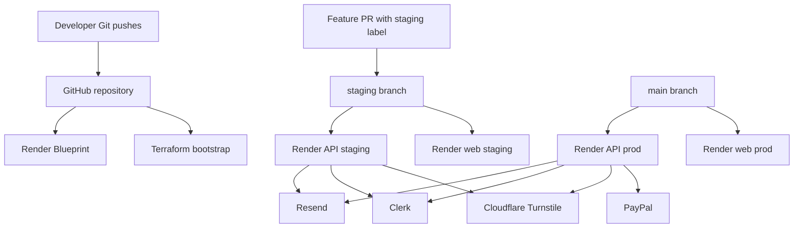

# Cloud Architecture

This system is intentionally split into static public delivery, stateful API runtime, and external providers.

## Goals

- Stay inside Render free tier.
- Keep public pages static.
- Keep API runtime stateless.
- Store secrets outside source control.
- Keep promotion rules explicit and auditable.

## Deployment model

## Tier constraints

- Free web services can sleep when idle.
- Static sites stay cheap and predictable.
- No persistent disks are used.
- No worker or cron services are required for the current feature set.

## Promotion

Production:

- source: `main`
- release marker: SemVer tag

Staging:

- source: `staging`
- gated by PR branch, label, and draft status

## Control planes

- Render Blueprint owns service shape.
- Terraform owns environment-specific state.
- GitHub Actions owns branch promotion policy.
