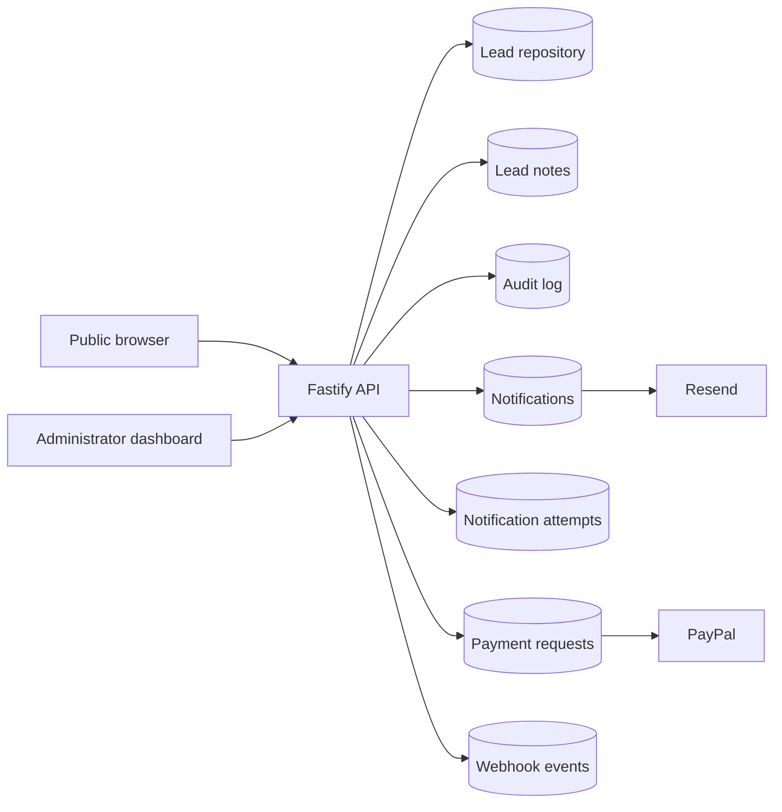
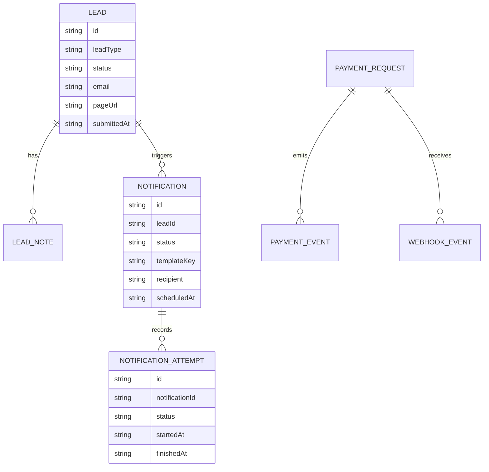

# Data Architecture

This application has a small but explicit data model. The goal is to keep every persistent object explainable from the user flow that creates it.

## Data domains

- leads
- lead notes
- audit events
- notifications
- notification attempts
- payment requests and related payment events
- webhook delivery records

## Data flow

## Storage principles

- Public submissions are persisted before any best-effort outbound side effects.
- Notification delivery is tracked as a separate record from the lead itself.
- Attempt records provide a timeline for retries and failures.
- Audit events are append-only and capture actor, action, and entity references.

## Logical model

## Consistency rules

- Lead creation is authoritative.
- Notification state can fail independently without rolling back the lead.
- Retry is idempotent on the notification record.
- Webhook records are minimized to avoid storing provider payload noise.
