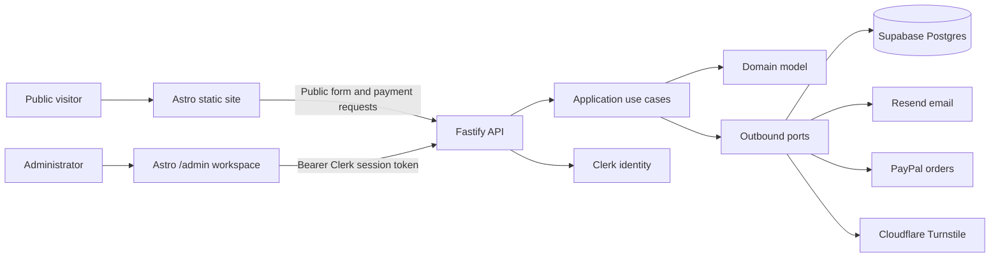
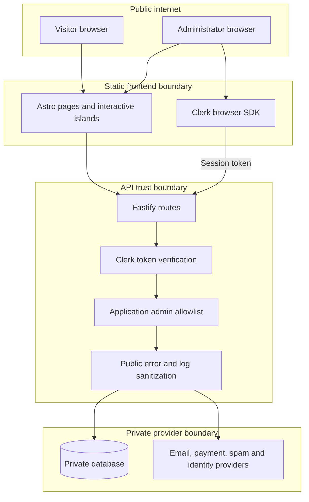
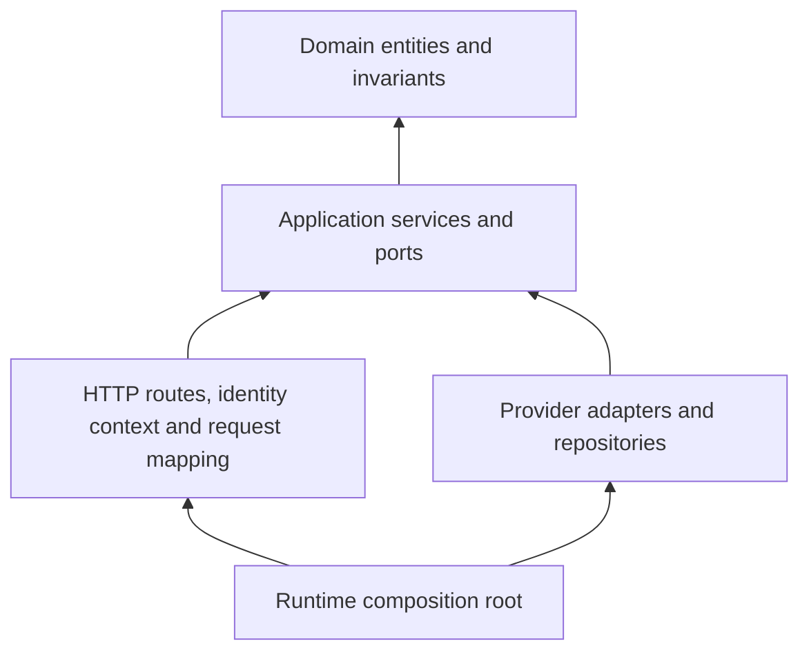
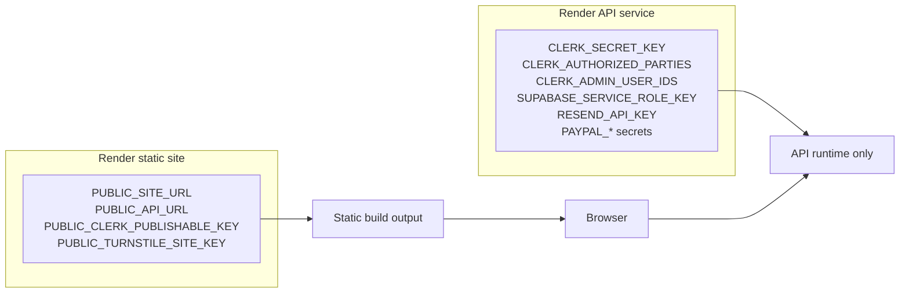

# Enterprise architecture overview

The platform is an independent consulting operating system rather than a brochure site. It combines
a static bilingual public frontend, a protected administrator workspace, a Fastify API, provider
adapters and private persistence behind explicit trust boundaries.

## Runtime topology

The static site can expose only `PUBLIC_` variables. The API owns private provider credentials,
identity verification, persistence, audit events and operational readiness.

## Trust boundaries

Authentication and authorization are intentionally separate. Clerk verifies that a browser session is
real; the application still decides whether the verified Clerk user is an administrator through
`CLERK_ADMIN_USER_IDS` and `CLERK_ADMIN_EMAILS`.

## Capability layering

Domain code imports no framework or provider SDK. Provider payloads are translated at adapter edges.
Shared packages carry contracts and configuration validation, not business workflow orchestration.

## Deployment and configuration model

Static-site environment changes require a rebuild because `PUBLIC_` values are embedded into the
generated frontend. API-only secrets must never be exposed through Astro public variables, logs,
GitHub issues, screenshots or documentation examples.

## Local development path

Local development mirrors the production boundary:

- Public pages and forms can run without Clerk.
- `/admin` requires a real Clerk development publishable key.
- Protected API routes require private Clerk configuration and an explicit admin allowlist.
- There is no anonymous local administrator bypass.
- `pnpm dev:api` and `pnpm dev:web` load the workspace-root `.env` file, while real shell variables
  still take precedence.

See [Local Clerk administrator setup](../development/local-admin-clerk.md) for the local runbook.

## Operational priorities

1. Fail closed for administrator access.
2. Keep provider credentials server-side.
3. Keep public form intake anonymous and abuse-resistant.
4. Sanitize public errors and operational logs.
5. Preserve deterministic tests with fakes; document real-provider smoke checks separately.
6. Treat provider replacement as an adapter concern, not a domain rewrite.
