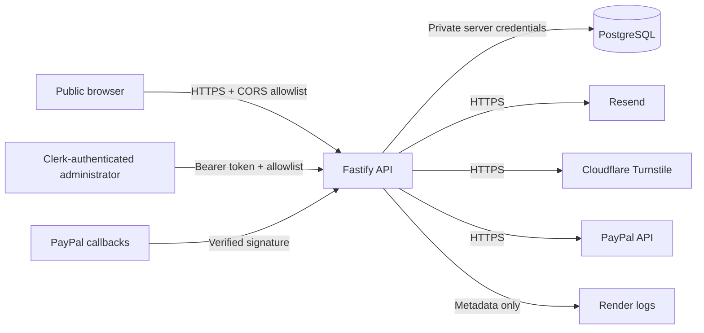

# Security, privacy and operational observability

Security controls are applied at the HTTP, application, provider and persistence boundaries. The objective is not to claim perfect prevention. It is to reduce attack surface, minimize retained information, make privileged actions reconstructable and preserve enough safe telemetry to operate the service.

## Trust boundaries



The static Astro website is public and contains no private credentials. All provider secrets remain server-side runtime variables. Administrator access requires both a verified Clerk identity and an explicit user-ID or email allowlist match.

## Threat model

| Surface | Principal threats | Controls |
| --- | --- | --- |
| Public forms | automated submissions, oversized payloads, duplicate retries, origin abuse | schema validation, route payload limits, rate limits, timing check, honeypot, optional Turnstile, CORS allowlist, durable idempotency |
| Administrator routes | stolen token, valid but unauthorized account, bulk data extraction | Clerk verification, authorized-party checks, administrator allowlist, no-store responses, audit events, sanitized errors |
| Payment links | guessed identifiers, client-side amount changes, duplicate capture | unguessable public tokens, server-owned amount and currency, provider verification, deterministic idempotency, unique provider references |
| Payment callbacks | forged signature, replay, excessive provider payload retention | signature verification, unique event IDs, summary-only persistence, reconciliation against server records |
| Logs | credential or personal-data leakage, log injection | request logging disabled, allowlisted metadata serializers, broad Pino redaction, control-character removal, production stack suppression |
| Diagnostics | infrastructure disclosure | minimal public readiness, detailed diagnostics behind administrator authentication, release identifiers validated and truncated |
| CSV exports | formula execution, untracked bulk extraction | spreadsheet-cell neutralization, authenticated export, persistent audit event without search terms or row contents |

## HTTP defaults

Every API response receives:

- `Cache-Control: no-store, max-age=0`
- `Pragma: no-cache`
- `X-Robots-Tag: noindex, nofollow, noarchive`
- restrictive `Permissions-Policy`
- strict Content Security Policy with no default resource sources
- `Referrer-Policy: no-referrer`
- cross-origin isolation headers appropriate for an API
- HSTS in Production
- a correlation ID

Disallowed browser origins receive a controlled `403 ORIGIN_NOT_ALLOWED` response. OpenAPI is available by default outside Production and disabled by default in Production.

## Logging policy

Application request logs contain only:

- correlation ID;
- HTTP method;
- Fastify route template, never the raw URL;
- response status;
- elapsed time;
- controlled outcome or error code.

The logger never intentionally records request bodies, webhook bodies, contact details, message text, authorization headers, cookies, API keys or provider credentials. Defense-in-depth redaction remains configured for common sensitive field names. Production error serialization excludes stack traces.

A correlation ID is the bridge between a visitor-visible error, safe application logs and persistent audit events. It is not an authentication credential.

## Error boundary

Public errors follow the stable contract:

```json
{
  "code": "CONTROLLED_ERROR_CODE",
  "message": "Safe public explanation",
  "correlationId": "request-reference",
  "fieldErrors": {}
}
```

Provider response messages, internal hostnames, stack traces and credential values are never returned. Retryable and non-retryable payment-provider failures use generic public messages while preserving a controlled internal error code.

## Payment callback minimization

The original PayPal callback is held in memory only for signature verification and reconciliation. The persistence adapter stores only:

- provider event ID and type;
- resource ID and status;
- related order or capture IDs;
- internal custom reference;
- amount and currency when required for reconciliation;
- verification and processing status.

Payer identity, provider navigation links and unrelated callback fields are discarded before persistence.

## Audit coverage

Persistent audit events cover:

- lead submission;
- lead status changes, archive and spam classification;
- administrator notes;
- bulk lead export;
- payment request creation and state changes;
- verified provider-driven payment changes.

Audit metadata must remain descriptive but non-sensitive. Search terms, lead contents, emails, message bodies and credentials do not belong in audit metadata.

## Readiness and diagnostics

Public `/ready` returns only service identity, version, aggregate readiness, timestamp and total duration. It does not expose capability names or provider states.

Protected `/api/admin/diagnostics` adds:

- individual capability state and latency;
- environment and truncated release identity;
- control posture;
- configured retention policy.

Probe exceptions become controlled `unavailable` results rather than crashing the readiness endpoint.

## Retention baseline

| Domain | Baseline | Trigger | Enforcement |
| --- | ---: | --- | --- |
| Leads | 730 days | last activity or closure | administrator review |
| Spam-classified leads | 30 days | spam classification | administrator review |
| Lead notes | 730 days | parent lead disposal | administrator review |
| Notifications and attempts | 180 days | terminal delivery state | administrator review |
| Payment records | 2190 days | final payment state | administrator review |
| Webhook summaries | 180 days | processing completion | administrator review |
| Audit events | 730 days | event creation | administrator review |
| Operational logs | 30 days | log creation | Render retention controls and review |

These are operating defaults, not a promise to delete records where a contract, tax requirement, active engagement, dispute or legal hold requires continued retention. Automated deletion is intentionally not implied by the current `manual-review` enforcement value. A future scheduled retention job must use the same policy module and add deletion audit events before claiming automatic enforcement.

## Verification

Automated tests cover:

- security and privacy headers;
- CORS rejection;
- sanitized public and provider errors;
- metadata-only logger serializers and redaction paths;
- resilient readiness probes;
- protected diagnostics;
- retention validation;
- payment callback minimization;
- audited and spreadsheet-safe exports.

## Primary references

- Fastify logging: https://fastify.dev/docs/latest/Reference/Logging/
- OWASP Logging Cheat Sheet: https://cheatsheetseries.owasp.org/cheatsheets/Logging_Cheat_Sheet.html
- Helmet plugin: https://github.com/fastify/fastify-helmet
- Render environment variables: https://render.com/docs/configure-environment-variables
