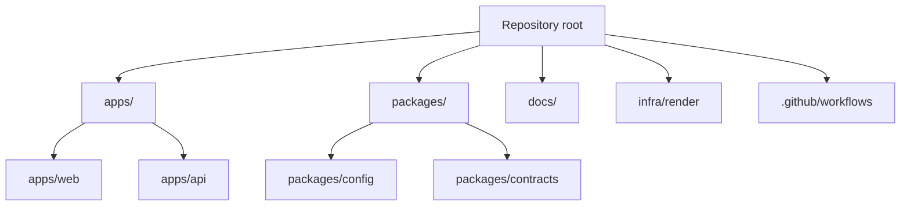
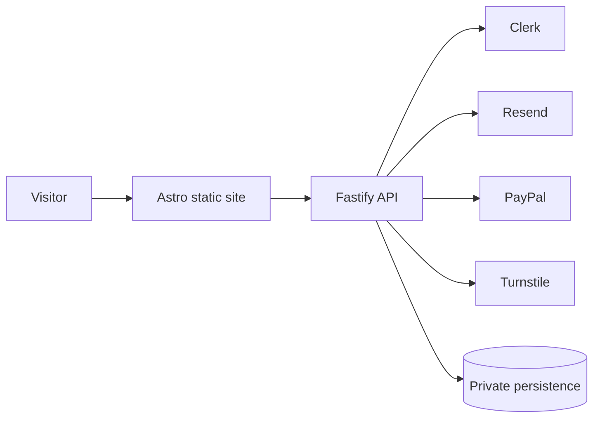
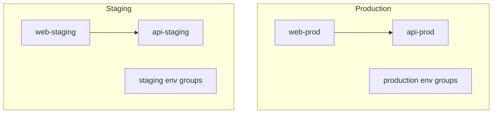

# Topology

This repository uses a monorepo topology with a strict separation between public presentation and backend application behavior.

## Repository topology

## Runtime topology

## Environment topology

## Operational notes

- Render services are expected to be recreated or reconciled from code.
- The `staging` branch is not a developer scratchpad. It is a promotion target.
- `main` is the release line and should be tagged using SemVer.
