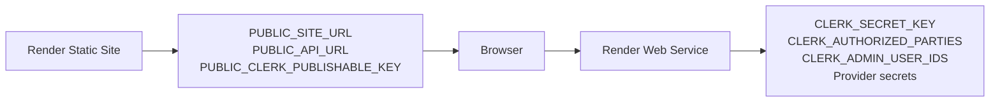

# Deployment

The initial topology uses a Render Static Site for Astro and a Render Free Web Service for Fastify. Supabase, Clerk, Resend, PayPal and Cloudflare Turnstile remain replaceable integrations.

## References

- [Enterprise architecture overview](../architecture/enterprise-architecture.md)
- [Verified provider baseline](../providers/verified-provider-baseline-2026-06-15.md)
- [Architecture decisions](../adr/README.md)
- [Mobile administration and provider setup](../operations/mobile-admin-provider-setup.md)

The mobile administration requirement exists because Carlos currently operates without a laptop. It does not constrain website compatibility. Public and administrator experiences must support mobile, tablet, laptop and desktop browsers.

## Confirmed Render constraints

- The free API sleeps after 15 minutes without inbound traffic.
- Public pages remain static while the API sleeps.
- Durable state cannot use the Render filesystem.
- Email uses HTTPS rather than SMTP.
- Blueprint secret placeholders use `sync: false` and values are entered in the dashboard.

The concrete `render.yaml`, health checks and smoke tests are delivered after the application adapters exist.

## Environment ownership

Static-site variables are embedded at build time and must not include API-only secrets. API variables
are runtime-only and must use exact origins for `CLERK_AUTHORIZED_PARTIES` and `CORS_ORIGINS`.

The remaining Clerk deployment work is tracked in GitHub issues #47, #50, #51, #52 and #53.
