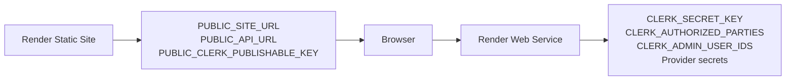

# Deployment

The initial topology uses a Render static site for Astro and a Render free web service for Fastify. Supabase, Clerk, Resend, PayPal, and Cloudflare Turnstile remain replaceable integrations.

## Infrastructure as Code

- [Render Blueprint](../../render.yaml)
- [Render deployment guide](render.md)
- [Render Terraform bootstrap](../../infra/render/README.md)

## References

- [Enterprise architecture overview](../architecture/enterprise-architecture.md)
- [Verified provider baseline](../providers/verified-provider-baseline-2026-06-15.md)
- [Architecture decisions](../adr/README.md)
- [Mobile administration provider setup](../operations/mobile-admin-provider-setup.md)

Mobile administration requirement exists because Carlos currently operates without a laptop. It does not constrain website compatibility. Public and administrator experiences must support mobile, tablet, laptop, and desktop browsers.

## Confirmed Render Constraints

- The free API sleeps after inactivity.
- Public pages remain static while the API sleeps.
- Durable state cannot use Render filesystem storage.
- Email uses HTTPS rather than SMTP.
- Blueprint secret placeholders use `sync: false` values entered in the dashboard.

Concrete `render.yaml`, health checks, smoke tests, and delivered application adapters already exist.

## Environment Ownership

Static-site variables embedded at build time must not include API-only secrets. API variables runtime-only must use exact origins `CLERK_AUTHORIZED_PARTIES` and `CORS_ORIGINS`. Remaining Clerk deployment work is tracked in GitHub issues #47, #50, #51, #52, and #53.
