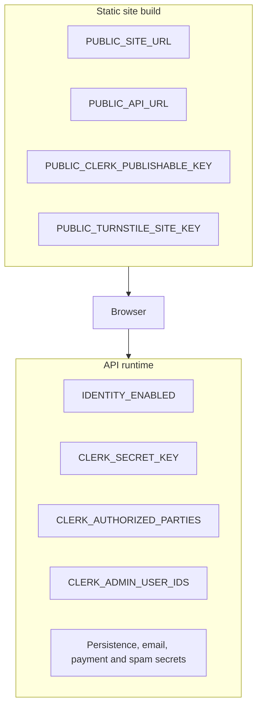

# Render environment intent

The Render project is named `Portfolio` and currently has two environments:

- Production: intended for the `main` branch.
- Staging: intended for non-main development branches.

This file records intent only. Render services, environment variables, health checks, preview behaviour and deployment policies are implemented in the dedicated deployment issue.

## Planned variable split

Staging should use Clerk development credentials. Production should use Clerk production credentials
only after staging sign-in, API readiness and administrator workflows are verified.
